# Responsive_Webpage_Using_Bootstrap4
This website is created using HTML5, CSS3.0, BS4. The responsiveness is achived using CSS media queries.

For this project I've used the bootstrap CDN.

**Link:** <https://smoumita19.github.io/Responsive_Webpage_Using_Bootstrap4/>

**For Desktop**

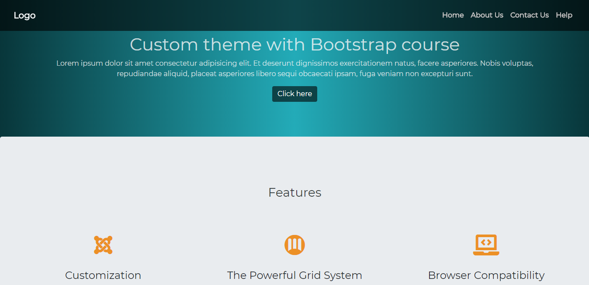
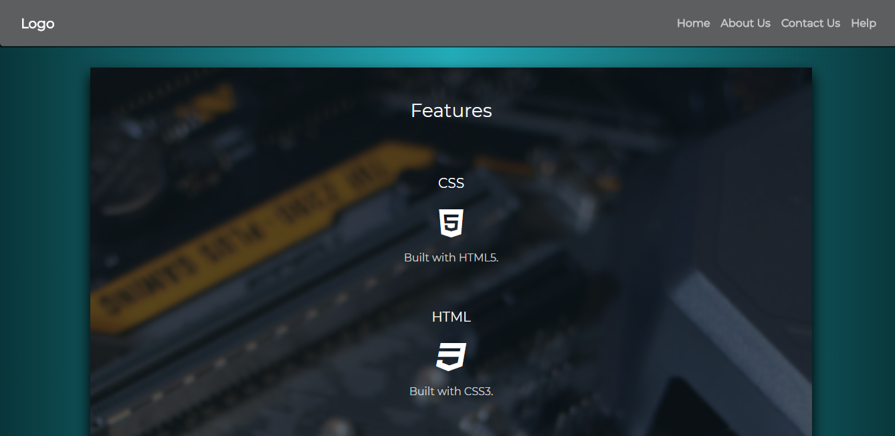
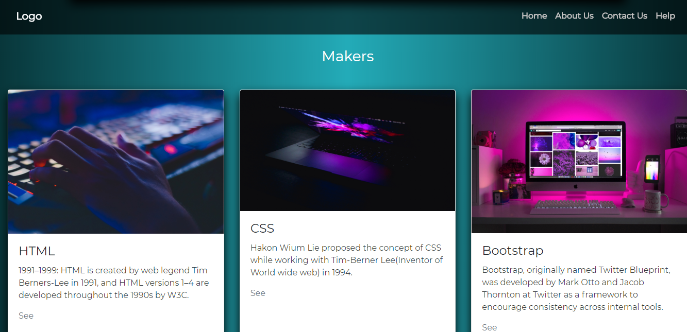

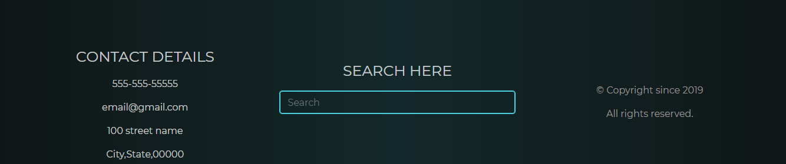

_________________________________________________________________________

**For smaller screen**

                                      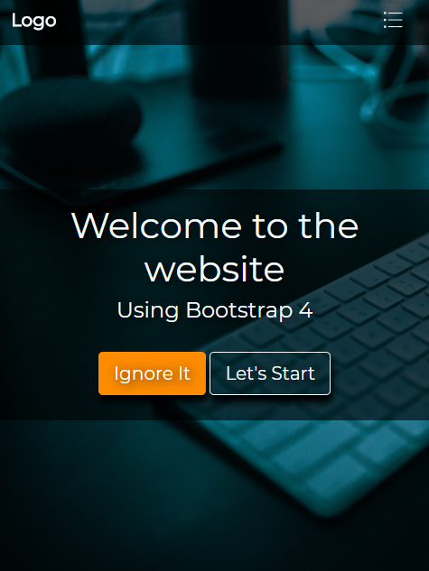
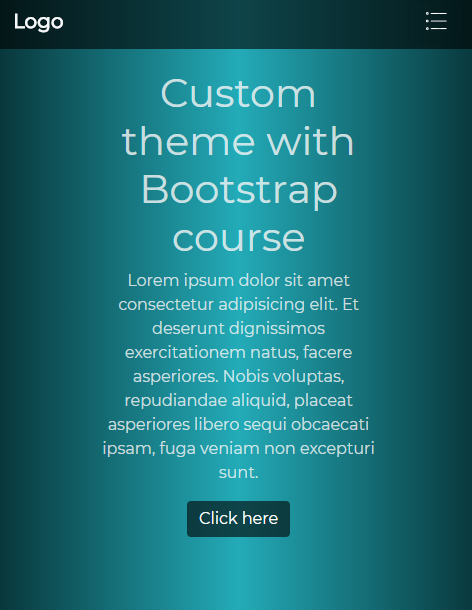
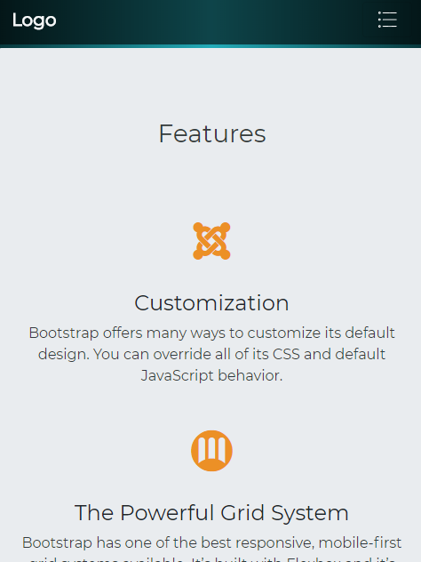
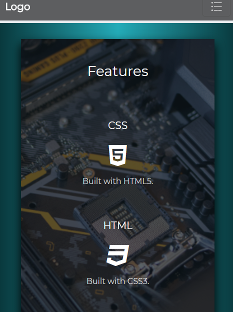
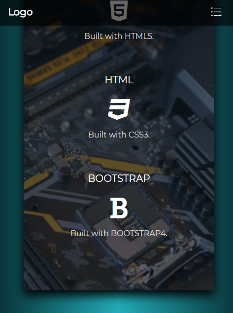
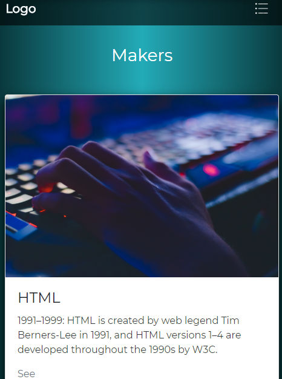
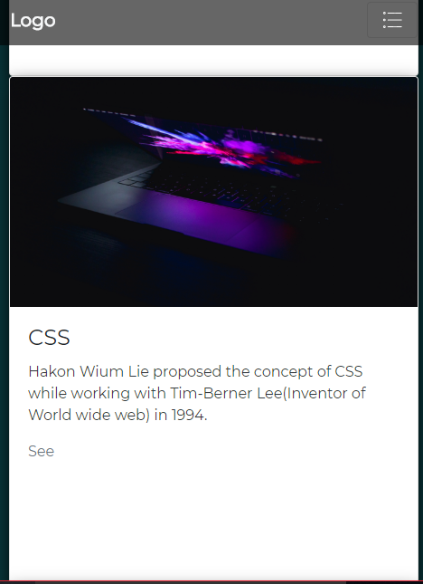
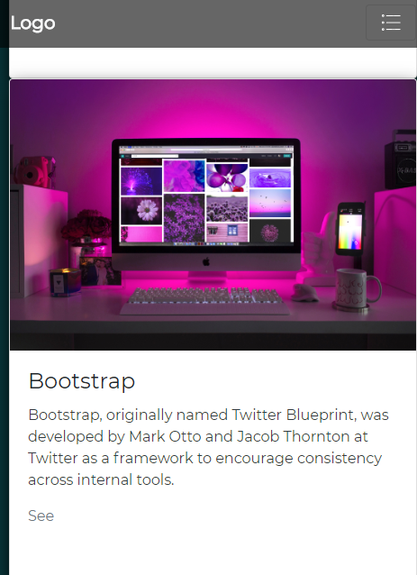
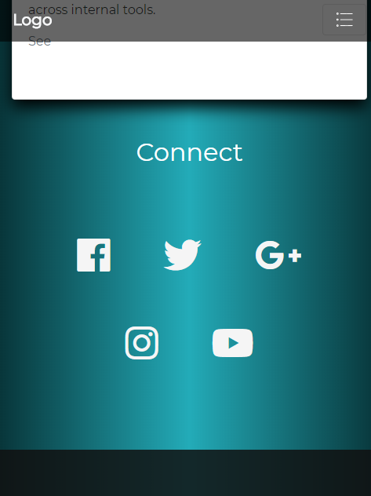
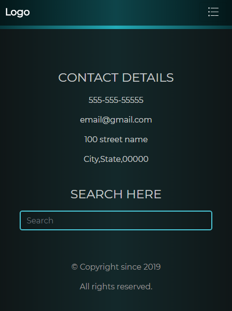

_________________________________________________________________________
